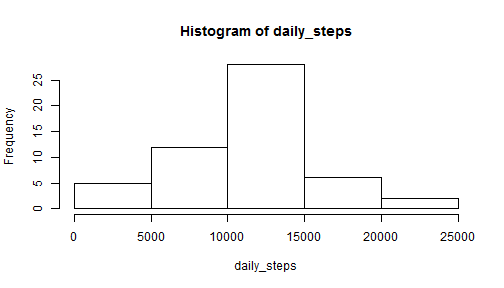
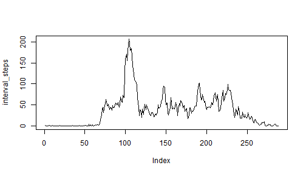
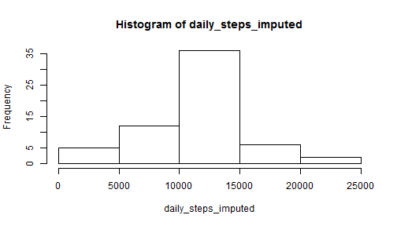
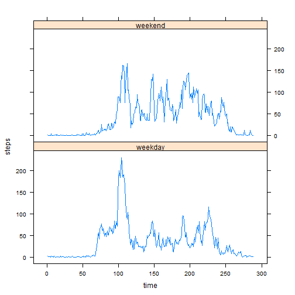

Reproducible Research: Peer Assessment 1
========================================================

## Loading and preprocessing the data


```r
setwd("C:/Users/Feng/Downloads/data science")

data <- read.csv("./reproducible research/RepData_PeerAssessment1/activity.csv")
```


## What is mean total number of steps taken per day?
- Calculate total steps taken for each day, ignoring missing data

```r
data1 <- data[complete.cases(data),]

daily_steps <- tapply(data1$steps, data1$date, sum)
```

- Make a histogram of the total number of steps taken each day


```r
hist(daily_steps)
```

 


- mean and median of total number of steps taken per day  

```r
mean(daily_steps, na.rm=TRUE)
```

```
## [1] 10766
```

```r
median(daily_steps, na.rm=TRUE)
```

```
## [1] 10765
```


## What is the average daily activity pattern?
- plot the average number of steps taken by time interval, averaged across all days

```r
data1$time <- factor(data1$interval)
interval_steps <- tapply(data1$steps, data1$time, mean)
plot(interval_steps, type="l")
```

 


- The 5-minute interval, on average across all the days in the dataset
that contains the maximum number of steps is:

```r
which.max(interval_steps)
```

```
## 835 
## 104
```

## Imputing missing values

1. the total number of missing values in the dataset

```r
sum(is.na(data$steps))
```

```
## [1] 2304
```
2. Create a new data set "imputed", and fill in all of the missing values 
using the mean for that 5-minute interval

```r
data$time <- factor(data$interval)
imputed <- data
for (i in 1:nrow(data)){
    if (is.na(imputed[i,"steps"]) ) {
        imputed[i,"steps"] <- interval_steps[imputed[i,"time"]]
    }
}
```
3. Make a histogram of the total number of steps taken each day


```r
daily_steps_imputed <- tapply(imputed$steps, imputed$date, sum)
hist(daily_steps_imputed)
```

 

4. the mean and median total number of steps taken per day

```r
mean(daily_steps_imputed)
```

```
## [1] 10766
```

```r
median(daily_steps_imputed)
```

```
## [1] 10766
```
Since missing data are imputed using mean value, imputed days all have the same 
daily value as an average day.  
Therefore, the new mean value stays the same, and the median is skewed 
slightly by the 8 imputed values, moving closer to the mean.

## Are there differences in activity patterns between weekdays and weekends?
- Create a new factor variable with two levels - "weekday" and "weekend"

```r
imputed$d <- weekdays(as.Date(imputed$date, "%Y-%m-%d"))
imputed$weekday <- ifelse(imputed$d == "Saturday" | imputed$d == "Sunday",
                          "weekend", "weekday")
```
- subset data into weekdays and weekends

```r
weekend <- imputed[imputed$weekday=="weekend",]
weekday <- imputed[imputed$weekday=="weekday",]
```
- calculate seperately average number of steps taken at given time interval

```r
weekend_steps <- tapply(weekend$steps, weekend$time, mean)
weekday_steps <- tapply(weekday$steps, weekday$time, mean)
```
- merge back into one dataset prepared for drawing the figure

```r
steps <- c(weekend_steps, weekday_steps)
day <- c(rep("weekend",length=length(weekend_steps)),
               rep("weekday",length=length(weekday_steps)))
a <- unique(imputed$time)
time <- c(a,a)

figure <- data.frame(steps, time, day)
```
- plotting the average number of steps taken by time intervals, 
averaged across all weekday days or weekend days 

```r
library(lattice)
```

```
## Warning: package 'lattice' was built under R version 3.1.1
```

```r
xyplot(steps ~ time | day, data=figure, type='l',layout=c(1,2))
```

 
